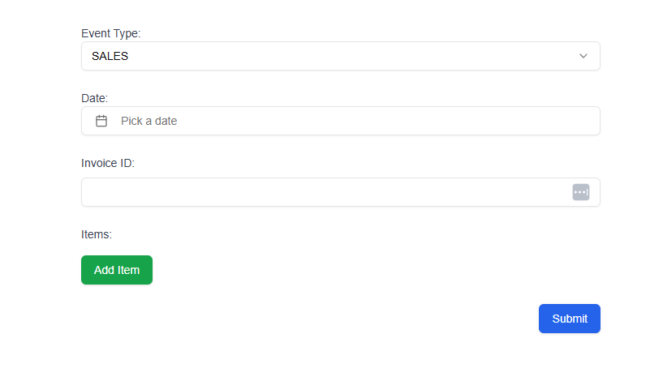
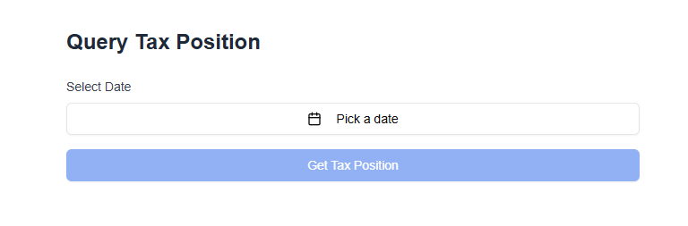
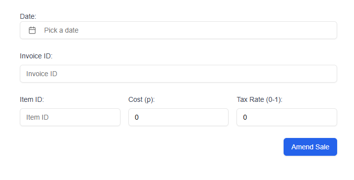

# Tax Service

## Overview

This service handles the processing of **Sales** and **Tax Payment Events**, as well as **Amendments** to sales. It includes functionality to:
1. Create sales and tax payment events.
2. Store amendments to sales, even if the original sale does not yet exist.
3. Apply the latest amendments to any newly created sale.

### Tech Stack
The following stack and versions are used to develop and deploy this service:
- Framework: Next.js - v15.1.4
- Programming Language: TypeScript - v5.x
- Database: MongoDB - Compatible with v6.x
- ORM/ODM: Mongoose - v8.9.3
- Environment Management: dotenv/docker
- Node.js: Node.js - v18.x

---
## Installation Guide

### Prerequisites
- Ensure Docker is installed on your system:
  - [Install Docker](https://www.docker.com/get-started).

### Steps

1. **Clone the Repository**:
   ```bash
   git clone https://github.com/benb20/tax-service
   cd tax-service
    ```

2. Build and Start the Services: Using Docker Compose, build and start the services:
    ```bash
    docker-compose up --build
    ```
3. Access the Application: Once the containers are running, the application will be available on:
    ```
    http://localhost:3000
    ```
4. Check MongoDB: MongoDB will be available on the following port:
    ```
    localhost:27017
    ```
5. Stop the Services: To stop the running services, run:

    ```bash
    docker-compose down
    ```
6. View Logs: If you want to view logs from the running containers, use:

    ```bash
    docker-compose logs -f
    ```

### Note:

If using docker as above, .env.local is not required. Otherwise, using MongoDB manually will require:
```
MONGO_URI=mongodb://0.0.0.0:27017/taxservice
```
## Features

1. **Transactions (http://localhost:3000/transactions)**:
   - Process and store sales events with associated items, costs, and tax rates.
   - Automatically apply the latest amendments (if any) to newly created sales.

2. **Tax Position (http://localhost:3000/tax-position)**:
   - Allows a user to query their tax position at any given point in time.

3. **Sale Amendments (http://localhost:3000/amend-sale)**:
   - Allow amendments to be submitted even if the corresponding sale does not yet exist.
   - Amendments are stored in a dedicated collection: `sale_amendment_events`.
   - Apply amendments automatically to sales once they are created.

---

## Project Structure

### Collections (MongoDB Models)

1. **`SaleEvent`**
   - Stores sales event data, including `invoiceId`, `items`, and `eventType`.
   - Schema includes:
     ```typescript
     {
       invoiceId: { type: String, required: true },
       items: [
         {
           itemId: { type: String, required: true },
           cost: { type: Number, required: true },
           taxRate: { type: Number, required: true },
         },
       ],
       eventType: { type: String, required: true },
       date: { type: Date, required: true },
     }
     ```

2. **`TaxPaymentEvent`**
   - Stores tax payment event data, including `amount` and `eventType`.
   - Schema includes:
     ```typescript
     {
       amount: { type: Number, required: true },
       eventType: { type: String, required: true },
       date: { type: Date, required: true },
     }
     ```

3. **`SaleAmendmentEvent`**
   - Stores amendments for sales, regardless of whether the corresponding sale exists.
   - Schema includes:
     ```typescript
     {
       invoiceId: { type: String, required: true },
       itemId: { type: String, required: true },
       cost: { type: Number, required: true },
       taxRate: { type: Number, required: true },
       date: { type: Date, required: true },
     }
     ```

---

## API Endpoints

### 1. **POST `/api/transactions`**
Handles the creation of new sales and tax payment events.

#### Request Body:
```json
{
  "eventType": "SALES",
  "invoiceId": "12345",
  "items": [
    {
      "itemId": "item-1",
      "cost": 100,
      "taxRate": 0.1
    }
  ],
  "date": "2023-01-10T00:00:00.000Z"
}
```
For **Tax Payment Events**:
```json
{
  "eventType": "TAX_PAYMENT",
  "amount": 1000,
  "date": "2023-01-10T00:00:00.000Z"
}
```


### 2. **GET `/api/tax-position`**
Allows a user to query their tax position at any given point in time. This endpoint calculates the tax position from ingested events. I have decided to only taken into existing sales, not pending amendments for sales which have not yet been entered.
#### Request Query Parameters:
- **date** (ISO 8601 format)
  - Mandatory.
  - Example: `2024-02-22T17:29:39Z`.

#### No Request Body.

#### Successful Response:
- Status Code: `200`.
- Response JSON Body:
```json
{
  "date": "2024-02-22T17:29:39Z",
  "taxPosition": 49
}
```

### 3. **PATCH `/api/sale`**
Handles amendments to sales. Stores the amendment in the sale_amendment_events collection, regardless of whether the sale exists. If the sale exists, updates the specified item's cost and tax rate.

Request Body:
```json

{
  "invoiceId": "12345",
  "itemId": "item-1",
  "cost": 150,
  "taxRate": 0.2,
  "date": "2023-01-10T00:00:00.000Z"
}
```

# Final notes/improvements

This was a good take-home task which presented some interesting challenges. I have addressed ambiguities to the best of my knowledge on the domain given without further clarification.

In terms of the specification of this project, I have also decided not to implement any more APIs than were listed. If I were to, I would have added a table view of transactions so you could visually see them, and then edit them from there more interactively. This would have required another ```GET``` request or two so I opted not to.

### Potential improvements
1) Use [mongodb-memory-server](https://github.com/typegoose/mongodb-memory-server) or [sqllite](https://www.npmjs.com/package/sqlite3) for ease of development/deployment 
2) Add github workflows or other CI/CD to auto run jest/run type checks like tsc.
3) Implement further jest tests.